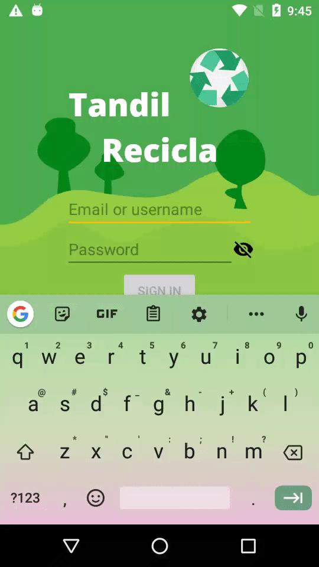
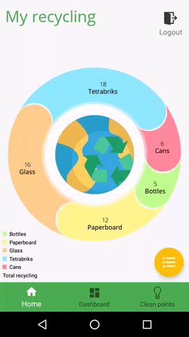

# Trabajo Final:  Introducción a la programación de dispositivos moviles - EXA UNICEN

## Informe

https://docs.google.com/document/d/1PCTIJF2hW52DJtY2MT5CmcKdi6FB9-aBSuOucm5md-0/edit?usp=sharing

## Para la realización de este trabajo se tuvieron como referencia las siguientes páginas 
- https://square.github.io/retrofit/
- https://github.com/ReactiveX/RxAndroid
- https://github.com/ReactiveX/RxJava/wiki/Error-Handling-Operators
- https://codingwithmitch.com/courses/rxjava-rxandroid-for-beginners/rx-operators-from-publisher/
- https://code.tutsplus.com/es/tutorials/sending-data-with-retrofit-2-http-client-for-android--cms-27845
- https://codebeautify.org/json-to-java-converter#copy
- http://www.jsonschema2pojo.org/
- https://codeday.me/en/qa/20190311/15387.html
- https://www.zoftino.com/android-ui-control-checkbox
- https://medium.com/@suragch/getting-and-setting-the-inputtype-of-an-android-edittext-5d6afcbf42c1
- https://www.youtube.com/watch?v=wG2l0DdTEAk
- https://www.youtube.com/watch?v=9Ye3j1c7pS4
- https://developer.android.com/training/basics/fragments/communicating
- https://alvinalexander.com/java/edu/pj/pj010018
- https://developer.android.com/guide/topics/ui/dialogs?hl=es-419#DialogFragment
- https://futurestud.io/tutorials/retrofit-2-catch-server-errors-globally-with-response-interceptor
- https://stackoverflow.com/questions/29921667/retrofit-2-catch-connection-timeout-exception/34091088#34091088
- https://stackoverflow.com/questions/43983399/get-current-date-in-yyyy-mm-dd-format-in-java-android
- https://www.tutorialspoint.com/design_pattern/builder_pattern.htm
- https://proandroiddev.com/enter-animation-using-recyclerview-and-layoutanimation-part-1-list-75a874a5d213
- https://help.github.com/es/github/writing-on-github/basic-writing-and-formatting-syntax#headings
- https://github.com/StackExchange/stack-blog/issues/275

## Iconos diseñados por 
https://www.flaticon.es/autores/freepik
from 
https://www.flaticon.com/free-icon/logout_660350?term=logout&page=1&position=1
https://www.flaticon.com/packs/recycle

https://www.flaticon.es/autores/google"
from 
https://www.flaticon.es/icono-gratis/lista_565700?term=lista&page=1&position=20

## Charts
https://github.com/PhilJay/MPAndroidChart

## Ejemplos

